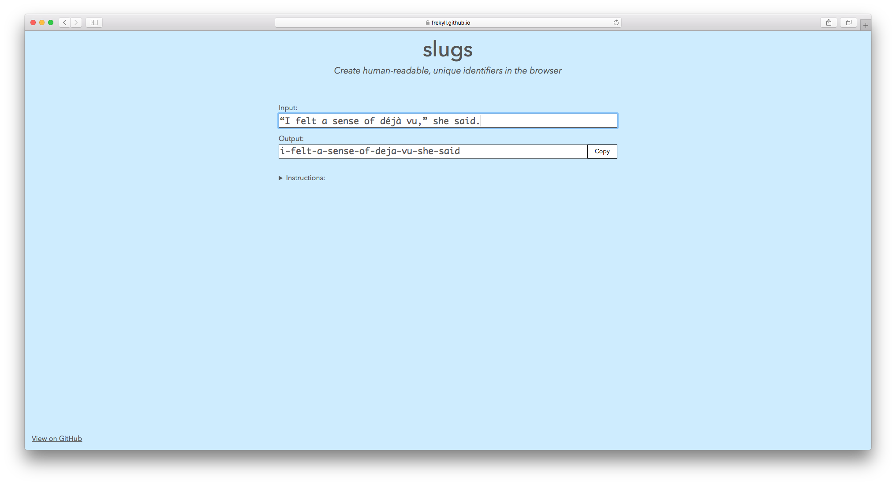

# slugs
> Create human-readable, unique identifiers in the browser

This is an experimental site built on [Browserify](http://browserify.org) technologies, including [nanohtml](https://github.com/choojs/nanohtml) and [sheetify](https://github.com/stackcss/sheetify).

## Related
- [caps](https://github.com/frekyll/caps)

## License

MIT © [Frekyll](https://github.com/frekyll)
